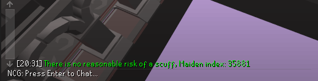
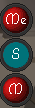

# Tob Utilities

The primary goal of this plugin is to minimize the need for mid-raid configuration changes as well as add some new functionalities

## Features:

### Maiden
- Warning for the chance of a scuff based on maidens index, this can come as a chat message, infobox or overlay panel
- Highlighting of scuffed spawns

### Bloat
- The ability to hide self or other players while in bloat room
- The ability to hide the floor in bloat room with a skybox override (Works with GPU/117)

### Nylocas
- Aggressive highlighting

### Verzik
- The ability to hide verzik with a hotkey 
- An overlay to indicate which player is holding dawnbringer. 
This works with party plugin as well to track if a teammate has it in their inventory

Note: If people in your party don't have this plugin, you're better off disabling party integration. For party integration to be effective you want everybody in the party to have it on. 

- An overlay to remind you to equip your lightbearer for P1 if you have it in your inventory

### Metronome
- A visual metronome which changes tick count based on room. This does not sync to the instance timer/timing of game mechanics but can be used to avoid mid raid configuration changes for visual metronome users

Special thanks to Vincent0955 who created the original visual metronome

### Change Log:
#### 1.0.1
- Added reset hotkey for visual metronome
#### 1.0.2
- Fixed hide self/hide others in bloat room to not hide protection prayers
- Fixed font size in visual metronome
- Fixed bug causing the person who started an instance to sync to the instance timer
- Changed visual metronome to fill rather than have colored border
- Added party integration for the dawnbringer overlay 
- Added a color setting for player orb to display that a player has the dawnbringer in their inventory
#### 1.0.3
- Added the option to receive the scuff warning chat message as an infobox or overlay panel
- Added an overlay reminding the player to equip their lightbearer for P1 Verzik
- Added the ability to outline players in bloat room
- Fixed a bug where equipped items were not considered for the Dawnbringer overlay when party integration was enabled but the player was not in a party.
#### 1.0.4
- Fixed lightbearer overlay not appearing due to new P1 Verzik Ids
#### 1.0.5
- Added the option to hide the floor in bloat room with a skybox override

I can be reached on discord at n_c_g. for any questions/comments/concerns or feature requests
